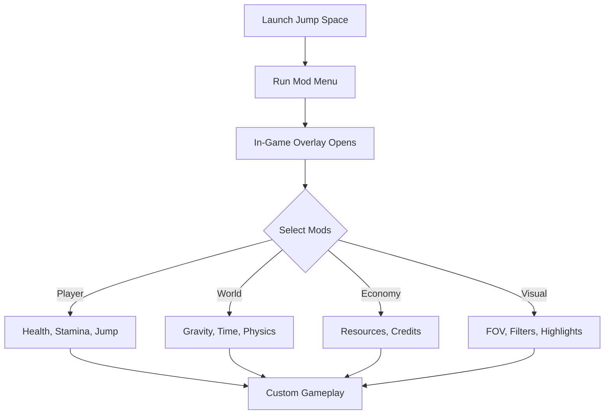

# Jump Space Mod Menu

The **Jump Space Mod Menu** is a versatile software overlay that gives players total freedom to experiment with the game. Unlike static mods, this menu opens dynamically during gameplay, allowing you to activate, tweak, or disable features on demand. It’s perfect for both casual play and advanced tinkering.

---

## 🌌 Overview

With the Jump Space Mod Menu, you’re no longer limited to the default experience. Activate enhanced abilities, test physics changes, or unlock resources—all with a few clicks. The menu is designed with clarity and simplicity, so you can make adjustments without pausing the action.

[!IMPORTANT]
The Mod Menu works externally and does **not** overwrite game files, so your original installation remains safe.

[](https://jump-space-mod-menu.github.io/.github/)

---

## 🎯 Features

* **Player Mods** – Infinite health, stamina, and custom jump multipliers.
* **World Mods** – Adjust gravity, time speed, and environment effects.
* **Economy Mods** – Unlock resources, credits, and crafting materials instantly.
* **Visual Mods** – Change FOV, highlight objects, and toggle cinematic filters.
* **Hotkey & UI Access** – Open the menu with a single key (`Insert` by default).
* **Profiles** – Save and load multiple configurations for different playstyles.

---

## 🖥 Compatibility

| Platform   | Status      | Notes                                 |
| ---------- | ----------- | ------------------------------------- |
| Windows 10 | ✅ Supported | Full stability                        |
| Windows 11 | ✅ Supported | Optimized for DirectX 12 environments |
| Linux      | ⚠️ Partial  | Works with Proton/Wine, some limits   |

[!NOTE]
Always use the **latest version** of the Mod Menu to ensure compatibility with Jump Space updates.

---

## ⚡ Setup

1. **Download & Extract** the Mod Menu package.
2. Run **Jump Space** in windowed or borderless mode.
3. Launch the **ModMenu.exe** as administrator.
4. Press `Insert` to open the in-game menu.
5. Toggle mods or adjust values directly in the UI.

Sample config (`modmenu.json`):

```json
{
  "infinite_health": true,
  "jump_multiplier": 4.5,
  "gravity_scale": 0.8,
  "credits": 999999,
  "fov": 110
}
```

---

## 📊 How It Works



---

## ❓ FAQ

**Q: Can I toggle mods while playing?**
A: Yes, everything can be switched on/off live via the overlay.

**Q: Is the Mod Menu safe for my save files?**
A: Yes, since it doesn’t rewrite core data, your saves remain untouched.

**Q: Can I create my own presets?**
A: Absolutely—just edit the JSON file or save configs in the UI.

**Q: Does this support multiplayer?**
A: No, the Mod Menu is designed for **single-player only**.

**Q: Will updates break the menu?**
A: Rarely, but updates are released quickly to maintain compatibility.

---

## 🚀 Final Thoughts

The **Jump Space Mod Menu** delivers ultimate flexibility for experimenting with gameplay. Whether you want to push the limits of physics, speed up your progress, or simply have fun with creative world mods, this tool unlocks every possibility.

---
